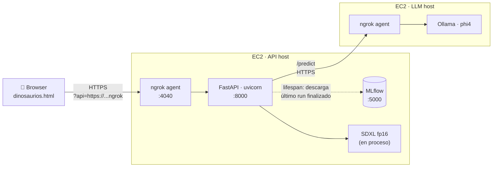
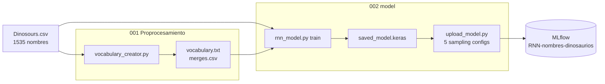

# Galería de Dinosaurios

Sistema end-to-end que **genera nombres de dinosaurios** con un RNN entrenado desde cero, **les inventa una descripción paleontológica** con un LLM local, y **produce una imagen** con un modelo de difusión. Todo accesible desde un sitio web desplegado en AWS.

Proyecto del curso de NLP — basado en el taller *"Modelos de lenguaje a nivel de caracteres con RNN"*.

---

## Arquitectura

### Flujo de inferencia (producción)



### Pipeline de entrenamiento (offline)



---

## Las cuatro partes del taller

| # | Componente | Implementación | Directorio |
|---|---|---|---|
| 1 | Generador de nombres | LSTM decoder-only entrenado por teacher forcing sobre tokens BPE | [001 Proprocesamiento/](001%20Proprocesamiento/), [002 model/](002%20model/) |
| 2 | Descripción con LLM | Phi4 (14B) vía Ollama, expuesto por ngrok | [003 Ollama config/](003%20Ollama%20config/) |
| 3 | Imagen generada | SDXL base 1.0 fp16, en proceso dentro de la API | [008 web/app/main.py](008%20web/app/main.py) |
| 4 | Integración web | FastAPI + frontend estático + Docker + EC2 + MLflow | [008 web/](008%20web/) |

---

## Cómo reproducir

### Pre-requisitos
- Python 3.12+, Docker
- AWS CLI configurado (si vas a desplegar a EC2)
- Authtoken de ngrok — **uno por agente simultáneo**, ver caveat al final

### 1. Entrenar el modelo y loguear runs a MLflow

```bash
# Generar artefactos BPE
cd "001 Proprocesamiento"
python vocabulary_creator.py "../000 data/Dinosours.csv"

# Entrenar + subir 5 configuraciones de muestreo a MLflow
cd "../002 model"
MLFLOW_TRACKING_URI=http://localhost:5000 python upload_model.py
```

### 2. Desplegar la API en EC2

```bash
./build.sh dino-api                      # MLflow + Docker build + contenedor corriendo
"008 web/app/start_ngrok.sh"             # túnel público HTTPS al puerto 8000
```

El script imprime la URL pública y la guarda en `~/ngrok_api.config`.

### 3. Configurar Ollama (segunda máquina)

Ver [003 Ollama config/README.md](003%20Ollama%20config/README.md). Pasos clave: Docker + `ollama run phi4` + `ngrok http 11434`.

### 4. Abrir el frontend

```
008 web/dinos-web/dinosaurios.html?api=<URL_pública_del_API>
```

El `?api=...` se persiste en `localStorage`, así que sólo hace falta pasarlo la primera vez.

---

## Decisiones de diseño

Tres decisiones se apartan del spec literal del taller — todas tienen justificación.

| Decisión | Spec del taller | Implementación | Razón |
|---|---|---|---|
| **Granularidad** | "A nivel de caracteres" | BPE / subpalabra (277 tokens) | Los nombres de dinosaurios tienen morfología muy repetitiva (`-saurus`, `-raptor`, `-ceratops`). Con BPE el modelo aprende esos sufijos como una unidad en vez de reaprenderlos letra a letra; reduce la longitud de secuencia y mejora la coherencia con un corpus pequeño (1535 nombres). |
| **Modelo de difusión** | "Liviano" (amused-512, FLUX) | SDXL base 1.0 fp16 | Calidad visual sobre velocidad; la galería es la parte que el usuario más ve. El costo de carga inicial se amortiza cargando el pipeline una sola vez en startup. |
| **Host del LLM** | SageMaker m5.xlarge + lifecycle script | EC2 regular | Mismo resultado funcional sin la complejidad de configurar Docker data-root y lifecycle hooks de SageMaker. |

---

## Stack tecnológico

| Capa | Tecnología |
|---|---|
| Entrenamiento | TensorFlow / Keras, NumPy |
| Tokenizador | BPE custom (stdlib + pandas) |
| Tracking de experimentos | MLflow |
| API | FastAPI + uvicorn |
| LLM local | Ollama + Phi4 (14B) |
| Difusión | diffusers + PyTorch + SDXL |
| Empaquetado | Docker |
| Hosting | AWS EC2 |
| Túnel público | ngrok |
| Frontend | HTML/CSS/JS vanilla |

---

## Tracking de experimentos

MLflow corre en `:5000` con el experimento `RNN-nombres-dinosaurios`. Cinco runs comparables, uno por combinación de muestreo (`top_k=5/10`, `top_p=0.80/0.90/0.95`), loguean:

- Hiperparámetros: `hidden_units`, `embedding_dim`, `epochs`, `batch_size`, `learning_rate`, `top_k`, `top_p`, `vocab_size`, `test_split`
- Métricas por época: `train_loss`, `train_accuracy`, `val_loss`, `val_accuracy`
- Métricas finales: `test_loss`, `test_accuracy`
- Artefactos: `saved_model.keras` y archivo `generated/` con los nombres producidos por la configuración

La API carga el último run finalizado del experimento en el evento de *startup*; reentrenar es loguear un nuevo run y reiniciar el contenedor — el código no se toca.

---

## Resultados

**Mejor configuración**: `top_k=10`, `top_p=0.90`, `temperatura=1.0`.

10 nombres curados con sus descripciones e imágenes en la galería del frontend. Análisis comparativo completo (top-k vs top-p vs temperatura) en [002 model/RESULTADOS.md](002%20model/RESULTADOS.md).

---

## Estructura del repositorio

```
.
├── 000 data/                       # Dataset (CSV de 1535 nombres)
├── 001 Proprocesamiento/           # Tokenización BPE
│   ├── vocabulary_creator.py       # Entrena BPE → vocabulary.txt + merges.csv
│   ├── token_encoder.py            # Codificador reusable
│   ├── tokens/                     # Artefactos generados
│   └── README.md                   # Detalle del módulo
├── 002 model/                      # Modelo RNN + upload a MLflow
│   ├── rnn_model.py                # Arquitectura, entrenamiento, generación
│   ├── upload_model.py             # Sube 5 configuraciones de muestreo
│   ├── saved_model.keras           # Modelo entrenado (ejemplo)
│   └── RESULTADOS.md               # Análisis cuantitativo y cualitativo
├── 003 Ollama config/              # Setup de Phi4 vía Ollama + ngrok
├── 008 web/
│   ├── app/                        # FastAPI
│   │   ├── main.py                 # Endpoints /generate /predict /generate-image
│   │   ├── requirements.txt
│   │   └── start_ngrok.sh          # Túnel HTTPS al API
│   ├── dinos-web/                  # Frontend estático
│   │   ├── dinosaurios.html
│   │   └── Imagenes generadas/
│   ├── mlflow/start_server.sh
│   └── ec2_start_server.sh
├── Dockerfile                      # Contenedor del API
├── build.sh                        # Deploy completo (MLflow + Docker + API)
├── user-data.sh                    # Bootstrap inicial de EC2
└── CLAUDE.md                       # Notas operativas
```

---

## Cumplimiento del spec del taller

| Requisito del taller | Estado |
|---|---|
| Normalización del texto | ✅ minúsculas + NFD + `[a-z0-9]` |
| Tokens de inicio y fin (`<SOW>`, `<EOW>`) | ✅ |
| Padding (`<PAD>`) y longitud `T` | ✅ |
| `X = [x₀..x_{T-1}]`, `Y = [x₁..x_T]` | ✅ teacher forcing |
| RNN/LSTM/GRU decoder-only | ✅ LSTM |
| Temperatura, top-k, top-p | ✅ 5 configuraciones en MLflow |
| 10 mejores nombres + análisis comparativo | ✅ galería + [RESULTADOS.md](002%20model/RESULTADOS.md) |
| Ollama + Docker + ngrok | ✅ |
| LLM local (no APIs externas) | ✅ Phi4 corre dentro del contenedor |
| Modelo de difusión + librerías | ✅ SDXL + diffusers + transformers + torch + accelerate |
| Imagen por cada uno de los 10 nombres | ✅ pre-generadas en [008 web/dinos-web/Imagenes generadas/](008%20web/dinos-web/Imagenes%20generadas/) |
| Sitio web con 3 secciones (modelo, ejemplos, interactiva) | ✅ |
| Botón "Nuevo Dinosaurio" que dispara generación + descripción + imagen | ✅ |
| Servicios expuestos por ngrok | ✅ Ollama y API |
| Desplegado en AWS | ✅ EC2 |

---

## Caveats operativos

- **ngrok free tier** permite un único agente online por cuenta. Si Ollama y la API corren con el mismo authtoken, uno mata al otro. Usar un authtoken por agente.
- **MLflow** corre en `localhost:5000` dentro de la EC2 del API; para que el evaluador acceda desde fuera hay que abrir ese puerto en el security group o exponerlo por ngrok adicional.
- **Cold start** del contenedor: SDXL fp16 tarda ~2 min en cargar en la primera invocación a `/generate-image`. El pipeline queda en memoria después.
- **IPs públicas de EC2** cambian al reiniciar la instancia sin Elastic IP. El frontend mitiga esto leyendo `?api=...` desde la URL y guardándolo en `localStorage`.
